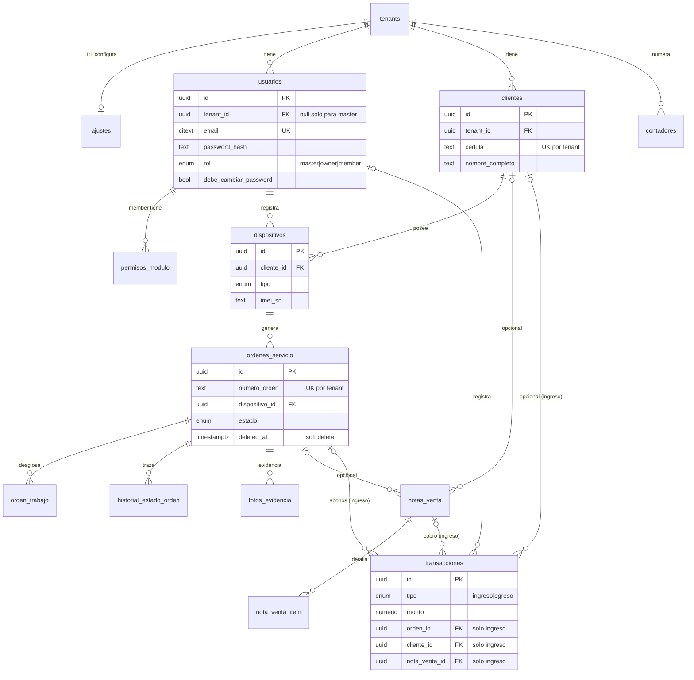

# FixFlow — Diseño de Base de Datos v2

**Motor:** PostgreSQL (Supabase) · **Acceso:** `@supabase/supabase-js` (sin ORM) · **Fecha:** 2026-07-06

Este documento define el esquema relacional nuevo, las decisiones sobre los puntos abiertos
(sección 10 del prompt de requerimientos) y el plan de migración desde el esquema actual.

---

## 1. Diagnóstico del esquema actual (evidencia en código)

El esquema viejo se reconstruyó desde la capa de servicios (`src/services/*.ts`). Defectos encontrados:

| # | Defecto | Evidencia | Consecuencia |
|---|---------|-----------|--------------|
| D1 | `clientes.cedula` es UNIQUE **global** (no por tenant) | `OrderService.saveOrder` → `upsert(..., { onConflict: 'cedula' })` | Un taller puede **pisar el cliente de otro taller** con la misma cédula. El upsert además reescribe `tenant_id`, robando el registro. Bug crítico de aislamiento. |
| D2 | Aislamiento multi-tenant solo en el cliente | Todos los servicios hacen `if (tenantId) query.eq('tenant_id', ...)` | Si `tenantId` es null (o alguien usa la anon key directo), **lee todos los tenants**. No hay RLS. |
| D3 | Doble camino al cliente | `ordenes_servicio.id_cliente` **y** `dispositivos.id_cliente`; `_mapOrder` tiene fallback `dispositivo?.cliente ?? cliente` | Datos duplicados que divergen; el código no sabe cuál es la verdad. |
| D4 | `eliminado` como entero 0/1 | `.eq('eliminado', 0)`, `.update({ eliminado: 1 })` | Tipo incorrecto; y `deleteOrder` actualiza **ambas** tablas (`ordenes_servicio` y `notas_venta`) con el mismo id a ciegas. |
| D5 | Items de venta no persistidos | `SaleItem[]` existe en `types/index.ts` pero ninguna tabla los guarda; se colapsan en `descripcion_general` | Imposible reportar qué se vendió. |
| D6 | Sin historial de estados ni log de notificaciones | `updateOrderStatus` solo hace UPDATE del campo `estado` | Sin trazabilidad, sin reenvío de WhatsApp, sin auditoría. |
| D7 | `ajustes` duplica datos de `tenants` | `nombre_empresa`, `ruc`, `telefono`, `direccion` viven en las dos tablas | Dos fuentes de verdad para la marca del taller. |
| D8 | Trabajos sin desglose | Solo `costo_total_reparacion` en la orden | El requerimiento pide "lista de trabajos con su costo". |
| D9 | Abono duplicado | `abono_inicial` en la orden **y** una fila en `ingresos` insertada por el front | Si una de las dos escrituras falla, la caja no cuadra. |
| D10 | Sin flag de primer login | `usuarios` no tiene `debe_cambiar_password` | El flujo de contraseña temporal no se puede implementar. |
| D11 | `egresos` nunca recibe orden/cliente | `PaymentService.savePayment` solo setea `id_orden` para ingresos | Confirma que esos campos en egreso eran herencia muerta del diseño anterior. |

---

## 2. Decisiones sobre los puntos abiertos (sección 10)

| # | Pregunta | Decisión | Justificación |
|---|----------|----------|---------------|
| 1 | ¿Permisos fijos o granulares? | **Roles fijos (`master`, `owner`, `member`) + permisos por módulo para members**, con alcance `propio`/`taller` por módulo. | La app tiene módulos cerrados (los 9 directorios de `src/features/`). Un sistema CRUD-por-tabla es sobre-ingeniería para esta UI; un rol plano no cubre "la secretaria ve caja de todos pero solo sus registros de dispositivos". La tabla `permisos_modulo` da exactamente eso. Un usuario pertenece a **un solo taller** (FK única `usuarios.tenant_id`). |
| 2 | Lista cerrada de estados | ENUM: `recibido → diagnostico → esperando_repuestos → listo → entregado`, más el terminal `no_reparado`. | Los primeros cinco ya son la lista viva en `types/index.ts` (`OrderStatus`) — migran 1:1 sin transformar. `no_reparado` cubre el caso pedido en requerimientos. ENUM y no tabla lookup: la lista es estable, el front la tiene tipada, y agregar un valor es un `ALTER TYPE` trivial. |
| 3 | ¿Egreso necesita orden/cliente? | **No. Se eliminan.** | D11: el código actual jamás los escribe. Un egreso es un gasto del taller. |
| 4 | ¿Cliente único por taller o global? | **Único por `(tenant_id, cedula)`.** | D1 es la prueba de por qué global es un bug, no una feature. Dos talleres pueden atender a la misma persona; son filas distintas. |
| 5 | ¿Historial de estados? | **Sí**: `historial_estado_orden` con estado anterior/nuevo, quién, cuándo y si se notificó por WhatsApp. | Necesario para el portal público `/status/:orden`, reenvío de notificaciones y auditoría (D6). |
| 6 | ¿Nota de venta sin orden? | **Sí.** `orden_id` nullable; y se agrega `nota_venta_item` para el detalle. | El flujo "NT / venta directa" ya existe en `OrderService.saveOrder`. Los items hoy se pierden (D5). |
| 7 | Motor y ORM | **PostgreSQL en Supabase, sin ORM** (supabase-js + RPCs para operaciones transaccionales). | Es el stack actual; no hay razón para cambiarlo. Lo que SÍ cambia: el aislamiento pasa a **RLS en el servidor** (D2). |

**Decisiones adicionales (normalización):**

- **`ordenes_servicio` pierde `id_cliente`**: el cliente se deriva vía `dispositivo → cliente` (elimina D3). Toda orden requiere dispositivo; la venta sin dispositivo es una nota de venta, no una orden.
- **`ordenes_servicio` pierde `abono_inicial` y `costo_total_reparacion`**: el costo total es la suma de `orden_trabajo` (líneas de trabajo, D8); el abono es una fila en `transacciones` ligada a la orden (D9). La vista `v_orden_saldo` expone total/abonado/saldo para la UI y el ticket. **Una sola fuente de verdad para el dinero.**
- **`ingresos` + `egresos` se unifican en `transacciones`** con columna `tipo`: la UI ya los trata como una sola lista (`PaymentService.getPayments` mergea y re-ordena los dos arrays). Un CHECK garantiza que los egresos no lleven orden/cliente/nota.
- **Soft delete con `deleted_at timestamptz`** (null = vivo) en lugar del entero `eliminado` (D4).
- **`tenant_id` en TODAS las tablas del tenant** (incluso donde es derivable, como `fotos_evidencia` u `orden_trabajo`): desnormalización deliberada y estándar en Supabase para que cada política RLS sea un `USING (tenant_id = ...)` plano, sin subqueries. Es la única excepción consciente a la 3FN.
- **Marca del taller vive solo en `tenants`** (D7); `ajustes` queda solo con configuración operativa (logo, plantilla WhatsApp, impresora, términos).

---

## 3. Esquema — DDL completo

```sql
-- ════════════════════════════════════════════════════════════
-- EXTENSIONES Y TIPOS
-- ════════════════════════════════════════════════════════════
create extension if not exists citext;
create extension if not exists pgcrypto;

create type rol_usuario          as enum ('master', 'owner', 'member');
create type modulo_app           as enum ('dashboard','registro','dispositivos','ventas',
                                          'clientes','caja','reportes','configuracion','usuarios');
create type alcance_permiso      as enum ('propio', 'taller');
create type estado_orden         as enum ('recibido','diagnostico','esperando_repuestos',
                                          'listo','entregado','no_reparado');
create type tipo_dispositivo     as enum ('celular','tablet','laptop','impresora','tv','lavadora',
                                          'refrigerador','microondas','cocina','calefon','plancha',
                                          'licuadora','otro');
create type etapa_foto           as enum ('antes','durante','despues');
create type metodo_pago          as enum ('efectivo','transferencia','tarjeta');
create type tipo_transaccion     as enum ('ingreso','egreso');
create type categoria_transaccion as enum ('reparacion','repuestos','arriendo',
                                           'servicios','insumos','otro');
create type tipo_impresora       as enum ('58mm','80mm','A4');

-- ════════════════════════════════════════════════════════════
-- TENANTS (talleres) — el SaaS
-- ════════════════════════════════════════════════════════════
create table tenants (
  id             uuid primary key default gen_random_uuid(),
  nombre_empresa text        not null,
  slug           text        not null unique check (slug ~ '^[a-z0-9-]+$'),
  email          citext      not null unique,
  ruc            text,
  telefono       text,
  direccion      text,
  plan           text        not null default 'basico',
  activo         boolean     not null default true,
  created_at     timestamptz not null default now(),
  updated_at     timestamptz not null default now()
);

-- ════════════════════════════════════════════════════════════
-- USUARIOS Y PERMISOS
-- ════════════════════════════════════════════════════════════
create table usuarios (
  id                     uuid primary key default gen_random_uuid(),
  tenant_id              uuid references tenants(id),
  email                  citext      not null unique,
  password_hash          text        not null,          -- bcrypt vía pgcrypto (crypt())
  nombre                 text        not null default '',
  rol                    rol_usuario not null default 'member',
  debe_cambiar_password  boolean     not null default true,
  activo                 boolean     not null default true,
  created_at             timestamptz not null default now(),
  -- master es el único sin tenant; owner/member SIEMPRE tienen taller
  constraint usuarios_rol_tenant check (
    (rol = 'master' and tenant_id is null) or
    (rol <> 'master' and tenant_id is not null)
  )
);
create index idx_usuarios_tenant on usuarios (tenant_id) where tenant_id is not null;

-- Permisos por módulo: SOLO aplica a rol 'member'.
-- owner ve todo su taller; master no opera. Sin fila = sin acceso al módulo.
create table permisos_modulo (
  usuario_id uuid            not null references usuarios(id) on delete cascade,
  modulo     modulo_app      not null,
  alcance    alcance_permiso not null default 'propio',  -- 'taller' = ve registros de todos
  primary key (usuario_id, modulo)
);

-- ════════════════════════════════════════════════════════════
-- AJUSTES (1:1 con tenant — PK = FK)
-- ════════════════════════════════════════════════════════════
create table ajustes (
  tenant_id            uuid primary key references tenants(id) on delete cascade,
  logo_url             text,
  whatsapp_template    text not null default '',
  tipo_impresora       tipo_impresora not null default '80mm',
  terminos_condiciones text not null default '',
  updated_at           timestamptz not null default now()
);

-- ════════════════════════════════════════════════════════════
-- CLIENTES
-- ════════════════════════════════════════════════════════════
create table clientes (
  id              uuid primary key default gen_random_uuid(),
  tenant_id       uuid   not null references tenants(id),
  nombre_completo text   not null,
  cedula          text   not null,
  telefono        text   not null default '',
  email           citext,
  direccion       text,
  created_at      timestamptz not null default now(),
  unique (tenant_id, cedula)          -- ← corrige D1: unicidad POR TALLER
);
create index idx_clientes_tenant_nombre on clientes (tenant_id, nombre_completo);

-- ════════════════════════════════════════════════════════════
-- DISPOSITIVOS
-- ════════════════════════════════════════════════════════════
create table dispositivos (
  id              uuid primary key default gen_random_uuid(),
  tenant_id       uuid not null references tenants(id),
  cliente_id      uuid not null references clientes(id),
  tipo            tipo_dispositivo not null default 'celular',
  marca           text not null,
  modelo          text not null,
  imei_sn         text,
  estado_fisico   text not null default '',
  registrado_por  uuid references usuarios(id),
  created_at      timestamptz not null default now()
);
create index idx_dispositivos_tenant_imei on dispositivos (tenant_id, imei_sn);
create index idx_dispositivos_cliente     on dispositivos (cliente_id);

-- ════════════════════════════════════════════════════════════
-- ÓRDENES DE SERVICIO
--   · cliente derivado vía dispositivo (fin del doble camino D3)
--   · dinero derivado de orden_trabajo + transacciones (D8/D9)
-- ════════════════════════════════════════════════════════════
create table ordenes_servicio (
  id              uuid primary key default gen_random_uuid(),
  tenant_id       uuid not null references tenants(id),
  numero_orden    text not null,
  dispositivo_id  uuid not null references dispositivos(id),
  falla_reportada text not null,
  estado          estado_orden not null default 'recibido',
  creado_por      uuid references usuarios(id),
  created_at      timestamptz not null default now(),
  updated_at      timestamptz not null default now(),
  deleted_at      timestamptz,                       -- soft delete (reemplaza eliminado 0/1)
  unique (tenant_id, numero_orden)
);
create index idx_ordenes_tenant_estado on ordenes_servicio (tenant_id, estado) where deleted_at is null;
create index idx_ordenes_tenant_fecha  on ordenes_servicio (tenant_id, created_at desc);
create index idx_ordenes_dispositivo   on ordenes_servicio (dispositivo_id);

-- Trabajos a realizar (paso 3 del wizard): una fila por trabajo con su costo
create table orden_trabajo (
  id          uuid primary key default gen_random_uuid(),
  tenant_id   uuid not null references tenants(id),
  orden_id    uuid not null references ordenes_servicio(id) on delete cascade,
  descripcion text not null,
  costo       numeric(12,2) not null check (costo >= 0)
);
create index idx_trabajo_orden on orden_trabajo (orden_id);

-- Historial de estados (D6): trazabilidad + reenvío WhatsApp + portal público
create table historial_estado_orden (
  id                bigint generated always as identity primary key,
  tenant_id         uuid not null references tenants(id),
  orden_id          uuid not null references ordenes_servicio(id) on delete cascade,
  estado_anterior   estado_orden,                    -- null en la primera fila
  estado_nuevo      estado_orden not null,
  cambiado_por      uuid references usuarios(id),
  whatsapp_enviado  boolean not null default false,
  created_at        timestamptz not null default now()
);
create index idx_historial_orden on historial_estado_orden (orden_id, created_at);

create table fotos_evidencia (
  id         uuid primary key default gen_random_uuid(),
  tenant_id  uuid not null references tenants(id),
  orden_id   uuid not null references ordenes_servicio(id) on delete cascade,
  etapa      etapa_foto not null,
  url_foto   text not null,
  created_at timestamptz not null default now()
);
create index idx_fotos_orden on fotos_evidencia (orden_id);

-- ════════════════════════════════════════════════════════════
-- NOTAS DE VENTA (con o sin orden — decisión Q6) + ITEMS (D5)
-- ════════════════════════════════════════════════════════════
create table notas_venta (
  id           uuid primary key default gen_random_uuid(),
  tenant_id    uuid not null references tenants(id),
  numero_nota  text not null,
  cliente_id   uuid references clientes(id),        -- nullable: venta rápida sin registrar cliente
  orden_id     uuid references ordenes_servicio(id),-- nullable: venta directa sin reparación
  metodo_pago  metodo_pago not null default 'efectivo',
  creado_por   uuid references usuarios(id),
  created_at   timestamptz not null default now(),
  deleted_at   timestamptz,
  unique (tenant_id, numero_nota)
);
create index idx_notas_tenant_fecha on notas_venta (tenant_id, created_at desc);

create table nota_venta_item (
  id              uuid primary key default gen_random_uuid(),
  tenant_id       uuid not null references tenants(id),
  nota_venta_id   uuid not null references notas_venta(id) on delete cascade,
  descripcion     text not null,
  cantidad        integer not null default 1 check (cantidad > 0),
  precio_unitario numeric(12,2) not null check (precio_unitario >= 0)
);
create index idx_item_nota on nota_venta_item (nota_venta_id);

-- ════════════════════════════════════════════════════════════
-- TRANSACCIONES (unifica ingresos + egresos)
--   · el abono inicial de una orden es un INGRESO con orden_id (D9)
--   · un egreso jamás lleva orden/cliente/nota (Q3, D11)
-- ════════════════════════════════════════════════════════════
create table transacciones (
  id             uuid primary key default gen_random_uuid(),
  tenant_id      uuid not null references tenants(id),
  tipo           tipo_transaccion not null,
  monto          numeric(12,2) not null check (monto > 0),
  metodo         metodo_pago not null,
  categoria      categoria_transaccion not null,
  descripcion    text not null default '',
  orden_id       uuid references ordenes_servicio(id),
  cliente_id     uuid references clientes(id),
  nota_venta_id  uuid references notas_venta(id),
  registrado_por uuid references usuarios(id),
  fecha          timestamptz not null default now(),
  constraint egreso_sin_vinculos check (
    tipo = 'ingreso' or
    (orden_id is null and cliente_id is null and nota_venta_id is null)
  )
);
create index idx_trans_tenant_fecha on transacciones (tenant_id, fecha desc);
create index idx_trans_orden        on transacciones (orden_id) where orden_id is not null;

-- ════════════════════════════════════════════════════════════
-- CONTADORES por tenant (numeración REP-0001 / NT-0001 sin colisiones)
-- ════════════════════════════════════════════════════════════
create table contadores (
  tenant_id uuid   not null references tenants(id),
  serie     text   not null,              -- 'REP' | 'NT'
  valor     bigint not null default 0,
  primary key (tenant_id, serie)
);

create or replace function siguiente_numero(p_tenant uuid, p_serie text)
returns text language sql as $$
  insert into contadores (tenant_id, serie, valor) values (p_tenant, p_serie, 1)
  on conflict (tenant_id, serie) do update set valor = contadores.valor + 1
  returning p_serie || '-' || lpad(valor::text, 5, '0');
$$;

-- ════════════════════════════════════════════════════════════
-- VISTAS DE APOYO
-- ════════════════════════════════════════════════════════════
-- Saldo por orden: total (trabajos), abonado (ingresos ligados), saldo
create view v_orden_saldo as
select
  o.id as orden_id,
  o.tenant_id,
  coalesce(t.total, 0)   as costo_total,
  coalesce(i.abonado, 0) as abonado,
  coalesce(t.total, 0) - coalesce(i.abonado, 0) as saldo
from ordenes_servicio o
left join (select orden_id, sum(costo) total from orden_trabajo group by 1) t
       on t.orden_id = o.id
left join (select orden_id, sum(monto) abonado from transacciones
           where tipo = 'ingreso' and orden_id is not null group by 1) i
       on i.orden_id = o.id;

-- Total por nota de venta
create view v_nota_venta_total as
select nota_venta_id, sum(cantidad * precio_unitario) as total
from nota_venta_item group by 1;
```

### Triggers de integridad

```sql
-- Historial automático en cada cambio de estado (nadie puede "olvidarse" de registrarlo)
create or replace function fn_log_estado() returns trigger language plpgsql as $$
begin
  if tg_op = 'INSERT' then
    insert into historial_estado_orden (tenant_id, orden_id, estado_anterior, estado_nuevo, cambiado_por)
    values (new.tenant_id, new.id, null, new.estado, new.creado_por);
  elsif new.estado is distinct from old.estado then
    insert into historial_estado_orden (tenant_id, orden_id, estado_anterior, estado_nuevo)
    values (new.tenant_id, new.id, old.estado, new.estado);
  end if;
  return new;
end $$;

create trigger trg_orden_estado
  after insert or update of estado on ordenes_servicio
  for each row execute function fn_log_estado();

-- updated_at automático
create or replace function fn_touch() returns trigger language plpgsql as $$
begin new.updated_at = now(); return new; end $$;
create trigger trg_touch_ordenes before update on ordenes_servicio for each row execute function fn_touch();
create trigger trg_touch_tenants before update on tenants          for each row execute function fn_touch();
```

### RPC transaccional para el wizard de 3 pasos

El registro (cliente + dispositivo + trabajos + orden + abono + fotos) debe ser **una transacción**.
Hoy `OrderService.saveOrder` hace 5 inserts encadenados desde el navegador: si el tercero falla,
quedan huérfanos. Se reemplaza por una función:

```sql
-- Firma (implementación completa en la migración):
create or replace function crear_orden_completa(
  p_cliente  jsonb,   -- {nombre_completo, cedula, telefono, email, direccion}
  p_dispositivo jsonb,-- {tipo, marca, modelo, imei_sn, estado_fisico}
  p_trabajos jsonb,   -- [{descripcion, costo}, ...]
  p_falla    text,
  p_abono    numeric default 0,
  p_metodo_abono metodo_pago default 'efectivo',
  p_fotos    jsonb default '[]'
) returns ordenes_servicio
security definer language plpgsql as $$ ... $$;
-- Internamente: upsert cliente ON CONFLICT (tenant_id, cedula), insert dispositivo,
-- siguiente_numero(tenant,'REP'), insert orden + trabajos + fotos,
-- y si p_abono > 0 → insert en transacciones. Todo o nada.
```

Lo mismo aplica a `crear_nota_venta(...)` (nota + items + ingreso automático).

---

## 4. Row Level Security (obligatorio, no opcional)

El defecto D2 no se arregla con esquema: se arregla con RLS. Regla general para toda tabla con `tenant_id`:

```sql
alter table clientes enable row level security;

create policy tenant_isolation on clientes
  using (tenant_id = (auth.jwt() ->> 'tenant_id')::uuid);
-- Repetir para: dispositivos, ordenes_servicio, orden_trabajo, historial_estado_orden,
-- fotos_evidencia, notas_venta, nota_venta_item, transacciones, ajustes, contadores.
```

Esto requiere que el `tenant_id` viaje en el JWT. Recomendación fuerte: **migrar la autenticación
casera (RPC `authenticate_user` + localStorage) a Supabase Auth** con `tenant_id` y `rol` como
custom claims (app_metadata). Mientras tanto, como mínimo, todas las operaciones deben pasar por
RPCs `security definer` que resuelvan el tenant en el servidor — nunca confiar en un filtro `.eq()`
del cliente.

- **Master (dueño del SaaS):** política adicional de **solo lectura** sobre tablas agregadas
  (o mejor: vistas de monitoreo `v_master_metricas` por tenant), sin política de escritura sobre
  datos operativos. Cumple el requerimiento "monitoreo global sin acceso operativo".
- **Portal público `/status/:orden`:** RPC `security definer` `consultar_orden_publica(p_numero, p_cedula)`
  que devuelve solo estado + historial. Nada de abrir SELECT anónimo a la tabla.
- **Alcance `propio` vs `taller` de los members:** se aplica en las políticas comparando
  `registrado_por / creado_por` con `auth.uid()` cuando el permiso del módulo es `propio`.

---

## 5. Diagrama entidad-relación



---

## 6. Plan de migración

### Estrategia

Ejecutar en un **branch de Supabase** (o proyecto de staging) primero; el corte a producción se hace
solo después de validar los checks del paso 6.4. El esquema nuevo se crea junto al viejo (mismo
nombre de tablas nuevas donde no colisionan; donde colisionan — `clientes`, `ordenes_servicio`, etc. —
se construye en el schema `v2` y se hace `ALTER TABLE ... SET SCHEMA` en el corte final).

### 6.1 Mapeo tabla por tabla

| Origen (viejo) | Destino (nuevo) | Transformación |
|---|---|---|
| `tenants` | `tenants` | Copia directa. Si `ajustes` viejo tiene `nombre_empresa/ruc/telefono/direccion` distintos, **gana `ajustes`** (es lo que el dueño editó y lo que se imprime en tickets). |
| `usuarios` | `usuarios` | `username` → `email` (si no matchea `^\S+@\S+$`, usar `username || '@migrar.fixflow.app'` y marcar `debe_cambiar_password = true`). Roles: `master`→`master`; `admin` con tenant→`owner`; `user`/`technician`→`member`. `debe_cambiar_password = false` para cuentas existentes con email real. |
| — | `permisos_modulo` | Seed para cada `member` migrado: todos los módulos operativos (`registro`,`dispositivos`,`ventas`,`clientes`,`caja`) con `alcance = 'taller'` (comportamiento actual: hoy todos ven todo; restringir después es decisión del owner, no de la migración). |
| `ajustes` | `ajustes` | Solo `logo → logo_url`, `whatsapp_template`, `tipo_impresora`, `terminos_condiciones` (si existía). El resto se fusiona en `tenants`. |
| `clientes` | `clientes` | **Deduplicar por `(tenant_id, cedula)`**: conservar la fila con datos más completos/recientes, guardar tabla puente `mig_clientes_map(old_id → new_id)` para remapear FKs. Cédulas null/vacías: generar `SIN-CEDULA-{old_id}` para no violar el NOT NULL (revisables después). |
| `dispositivos` | `dispositivos` | Remapear `id_cliente` vía `mig_clientes_map`. Huérfanos (cliente inexistente): asignar cliente placeholder `"Cliente desconocido (migración)"` por tenant. `tipo_dispositivo` vacío/desconocido → `'otro'`. |
| `ordenes_servicio` | `ordenes_servicio` | `eliminado = 1` → `deleted_at = now()`. Órdenes **sin dispositivo** (legacy, el código lo permitía): crear dispositivo stub `tipo='otro', marca='N/D'` con el `id_cliente` de la orden. `estado` migra 1:1 (mismos literales). `fecha_creacion` → `created_at`. |
| `ordenes_servicio.costo_total_reparacion` | `orden_trabajo` | Una fila por orden: `descripcion = 'Reparación (migrado)'`, `costo = costo_total_reparacion`. |
| `ordenes_servicio.abono_inicial` | `transacciones` | Solo si `abono_inicial > 0` **y no existe ya** un ingreso viejo `id_orden = orden AND descripcion LIKE 'ABONO INICIAL%'` (el front ya insertaba ese ingreso — no duplicar). |
| `ordenes_servicio.estado` | `historial_estado_orden` | Fila semilla por orden: `estado_anterior = null, estado_nuevo = estado, created_at = fecha_creacion`. |
| `fotos_evidencia` | `fotos_evidencia` | Copia + `tenant_id` heredado de la orden. |
| `notas_venta` | `notas_venta` + `nota_venta_item` | Cabecera directa; un item único `descripcion = descripcion_general, cantidad = 1, precio_unitario = total`. `eliminado` → `deleted_at`. |
| `ingresos` | `transacciones` | `tipo = 'ingreso'`; remapear `id_cliente`; `metodo/tipo → metodo/categoria`; valores fuera del enum → `'otro'` (log en tabla de excepciones). |
| `egresos` | `transacciones` | `tipo = 'egreso'`; descartar `id_orden`/`id_cliente` si existieran (D11). |
| — | `contadores` | Seed por tenant: `valor = max(numero)` extraído de `numero_orden`/`numero_nota` existentes por serie. |

### 6.2 Orden de carga (respeta FKs)

`tenants → usuarios → permisos_modulo → ajustes → clientes → dispositivos → ordenes_servicio → orden_trabajo → historial_estado_orden → fotos_evidencia → notas_venta → nota_venta_item → transacciones → contadores`

### 6.3 Tablas auxiliares de migración

```sql
create table mig_clientes_map (old_id bigint primary key, new_id uuid not null);
create table mig_excepciones (tabla text, old_id text, motivo text, payload jsonb, created_at timestamptz default now());
```
Todo registro que no pase una regla (enum inválido, FK rota, monto negativo) va a `mig_excepciones`
con su payload completo — **nada se descarta silenciosamente**.

### 6.4 Validación post-carga (checks obligatorios antes del corte)

```sql
-- 1. Conteos por tenant: viejo vs nuevo (tolerancia 0 salvo deduplicados documentados)
-- 2. Dinero cuadrado: sum(ingresos) + sum(abonos migrados) viejo == sum(transacciones ingreso) nuevo, por tenant
-- 3. Integridad: cero huérfanos
select count(*) from dispositivos d left join clientes c on c.id = d.cliente_id where c.id is null;      -- = 0
select count(*) from ordenes_servicio o left join dispositivos d on d.id = o.dispositivo_id where d.id is null; -- = 0
-- 4. Unicidad: duplicados de (tenant_id, cedula) = 0; (tenant_id, numero_orden) = 0
-- 5. Cross-tenant: cero filas donde orden.tenant_id <> dispositivo.tenant_id (detecta víctimas del bug D1)
-- 6. mig_excepciones revisada y aceptada explícitamente
```

El check 5 es especialmente importante: por el bug D1 (upsert global de cédula) **puede haber
clientes que hoy apuntan al tenant equivocado**. La migración debe reasignarlos según el tenant de
sus dispositivos/órdenes, no según el `tenant_id` corrupto de la fila.

### 6.5 Corte

1. Congelar escrituras (modo mantenimiento).
2. Migración incremental final (deltas desde el último run por `created_at`/`fecha`).
3. Swap de schema + deploy del front adaptado a los cambios de contrato (`transacciones`,
   `v_orden_saldo`, RPCs transaccionales).
4. El esquema viejo se conserva renombrado (`legacy`) por 30 días antes de borrarse.

---

## 7. Addendum de implementación (2026-07-06)

Al implementar, se descubrió que la base del proyecto Supabase estaba **vacía** (tablas borradas;
solo sobrevivían 24 funciones RPC huérfanas y el historial de migraciones). Decisiones tomadas con
el usuario: **arranque limpio** (sin ETL — la sección 6 queda como plan de referencia si aparece un
backup) y **adopción de Supabase Auth nativo**. Cambios sobre el diseño de las secciones 3–4:

- `usuarios.id` referencia `auth.users(id)`; desaparece `password_hash` (las credenciales viven en
  Supabase Auth). El perfil se crea automático con el trigger `handle_new_user` leyendo
  `tenant_id`/`rol` desde `raw_app_meta_data` (solo asignable vía admin API/dashboard, nunca por el cliente).
- Sin `citext`: emails con índice único funcional `lower(email)`.
- Aislamiento RLS con helpers `app_tenant_id()`/`app_rol()` (security definer que leen `usuarios`
  por `auth.uid()`) en lugar de claims JWT — no requiere configurar custom access token hook.
- El detalle de permisos por módulo/alcance quedó como **capa de aplicación**; RLS garantiza el
  aislamiento por tenant y la lectura de monitoreo (sin escritura) del master.
- Storage: buckets `logos` (público, sin policy de listado) y `evidencias` (privado, path
  `{tenant_id}/...` con policies por tenant).
- Migraciones aplicadas y versionadas en `supabase/migrations/20260707020000..020300` (esquema,
  lógica, RLS/storage, hardening por advisors). Smoke test transaccional validó numeración,
  historial automático por trigger, `v_orden_saldo` y el CHECK de egresos.
- Advisors de seguridad: limpios salvo 4 warnings intencionales (`consultar_orden_publica`
  ejecutable por `anon` = portal público; `app_tenant_id`/`app_rol` por `authenticated` = los usan
  las políticas RLS).

**Bootstrap pendiente (manual):** crear el usuario master en Authentication → Users del dashboard
y luego `update usuarios set rol='master', tenant_id=null where email='<tu-email>';`. Deshabilitar
el signup público en Auth settings (los usuarios los crea el master/owner vía admin API con
`app_metadata: { tenant_id, rol }`).

## 8. Impacto en el código (resumen para el refactor del front)

- `OrderService.saveOrder` → llama `rpc('crear_orden_completa', ...)`; desaparecen los 5 inserts encadenados.
- `PaymentService` → una sola tabla `transacciones`; desaparece el merge manual de dos arrays.
- `_mapOrder` → el fallback `dispositivo?.cliente ?? cliente` desaparece: el cliente siempre viene del dispositivo.
- Ticket/impresión → total y saldo salen de `v_orden_saldo`.
- `updateOrderStatus` → el historial y el flag de WhatsApp los maneja el trigger; el front solo marca `whatsapp_enviado` tras enviar.
- Login → flujo de `debe_cambiar_password` en el primer ingreso; plan de adopción de Supabase Auth.
